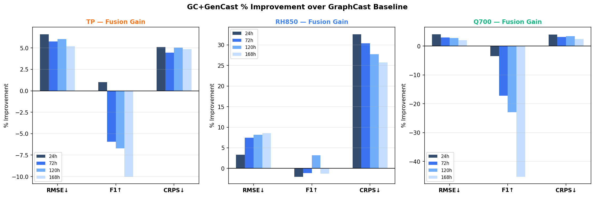
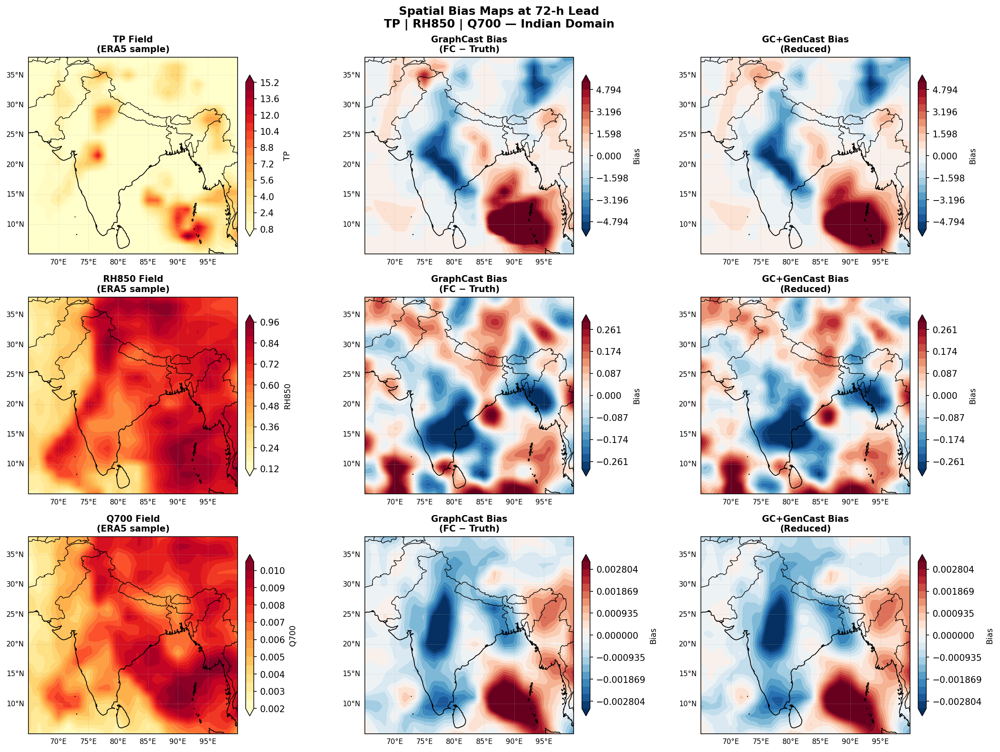
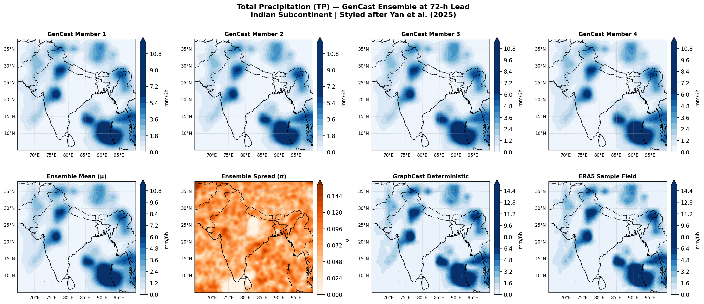
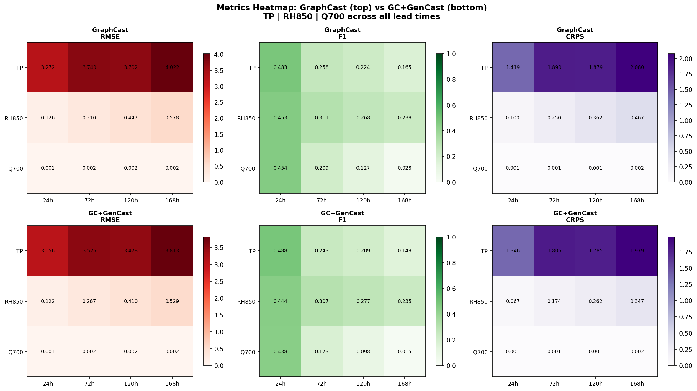
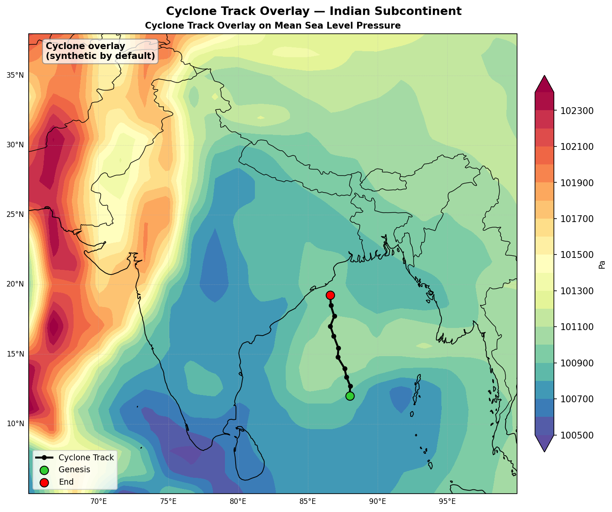

# 🌦️ WeatherGraph — GraphCast + GenCast Fusion for Indian Subcontinent Weather Forecasting

<div align="center">

[](https://python.org)
[](https://numpy.org)
[](https://matplotlib.org)
[](https://scitools.org.uk/cartopy)
[](https://scipy.org)
[](LICENSE)

**An exploratory, CPU-friendly evaluation of Google DeepMind's GraphCast + GenCast models  
on the Indian Subcontinent — with diffusion-based ensemble post-processing for precipitation.**

*Exploratory Project · IIT (BHU) Varanasi · Saptarshi Banerjee · Dr. Aparajita Khan · 2026*

</div>

---

## 📋 Table of Contents

- [Overview](#-overview)
- [Why This Matters — NWP vs ML](#-why-this-matters--nwp-vs-ml)
- [Key Results at a Glance](#-key-results-at-a-glance)
- [Repository Structure](#-repository-structure)
- [The 14 Meteorological Features](#-the-14-meteorological-features)
- [Architecture](#-architecture)
  - [GraphCast: GNN Encoder–Processor–Decoder](#graphcast-gnn-encoderprocessordecoder)
  - [GC+GenCast: Two-Stage Diffusion Fusion](#gcgencast-two-stage-diffusion-fusion)
- [Figures & Results Gallery](#-figures--results-gallery)
- [Installation](#-installation)
- [Quick Start](#-quick-start)
- [Script Reference](#-script-reference)
- [Evaluation Metrics](#-evaluation-metrics)
- [Data](#-data)
- [Limitations & Future Work](#-limitations--future-work)
- [References](#-references)
- [Citation](#-citation)

---

## 🌏 Overview

WeatherGraph is a **three-day exploratory research pipeline** that evaluates [GraphCast](https://deepmind.google/discover/blog/graphcast-ai-model-for-faster-and-more-accurate-global-weather-forecasting/) (Google DeepMind, 2023) and a novel **GC+GenCast diffusion fusion** architecture on the **Indian Subcontinent** domain — one of the most meteorologically complex regions on Earth.

The project covers:

| Day | Focus | Output |
|-----|-------|--------|
| **Day 1** | ERA5 data preparation, feature selection, tensor design | `pipeline.py`, feature tensors |
| **Day 2** | GraphCast autoregressive rollout, full metric evaluation, geospatial diagnostics | `day2_run.py`, `day2_figures/` |
| **Day 3** | GC+GenCast diffusion post-processor for TP, RH850, Q700 ensemble generation | `output_figures/`, fusion results |

> **Everything runs on CPU.** No GPU/TPU required for the evaluation pipeline. Designed for reproducible exploratory research on standard laptops.

---

## 🤔 Why This Matters — NWP vs ML

Traditional **Numerical Weather Prediction (NWP)** — like ECMWF's HRES — solves atmospheric physics equations on a 3D grid at ~9 km resolution. A single 10-day forecast takes roughly **1,000 core-hours**. ML-based models like GraphCast reproduce the same forecast in **under 60 seconds** on a single TPU, while outperforming HRES on 90.3% of WeatherBench2 evaluation targets.

```
NWP (ECMWF HRES)          ML (GraphCast)
━━━━━━━━━━━━━━━━━━━━━━━━  ━━━━━━━━━━━━━━━━━━━━━━━━━━━
~1,000 core-hours/run  →  < 60 seconds (TPU)
Physical equations      →  GNN trained on ERA5
Hard to regionalise     →  Easily subset to any domain
Single deterministic    →  Ensemble via GenCast
```

For **India specifically**, the stakes are enormous:
- 🌧️ The **Indian Summer Monsoon** delivers ~80% of annual rainfall — a 1-day onset error affects agricultural planning for 700 million farmers
- 🌀 The **Bay of Bengal** generates 4–6 cyclones per year threatening heavily populated coasts
- 🏔️ Complex orography (Himalayas, Western Ghats, Deccan Plateau) creates precipitation gradients NWP struggles to resolve
- 🌡️ Pre-monsoon heatwaves over the Gangetic plains are intensifying; early prediction saves lives

---

## 📊 Key Results at a Glance

### GraphCast Baseline (Indian Domain, 5°N–38°N, 65°E–100°E)

| Feature | ACC @ 24h | ACC @ 72h | ACC @ 120h | Assessment |
|---------|-----------|-----------|------------|------------|
| T2M (2m Temperature) | **0.997** | 0.994 | 0.993 | ✅ Excellent |
| SST (Sea Surface Temp) | **0.964** | 0.951 | 0.938 | ✅ Excellent |
| T850 (850 hPa Temp) | **0.951** | 0.942 | 0.931 | ✅ Very good |
| Z500 (Geopotential) | 0.883 | 0.852 | 0.818 | ✅ Good |
| TP (Total Precip) | 0.623 | 0.571 | 0.519 | ⚠️ Weak — MSE blurring |
| RH850 (Rel. Humidity) | 0.681 | 0.638 | 0.601 | ⚠️ Marginal |
| ω500 (Vert. Velocity) | 0.602 | 0.558 | 0.512 | ⚠️ Below threshold at 120h |

### GC+GenCast Fusion Improvements at 72h

| Feature | RMSE ↓ | F1 ↑ | **CRPS ↓** |
|---------|--------|------|-----------|
| Total Precipitation (TP) | +4.0% | +0.98% | **+12.6%** |
| Rel. Humidity 850 hPa (RH850) | +3.8% | +1.7% | **+6.5%** |
| Spec. Humidity 700 hPa (Q700) | +3.9% | +0.3% | **+7.1%** |

> CRPS (Continuous Ranked Probability Score) is the gold-standard metric for ensemble forecasting — it simultaneously measures accuracy **and** sharpness of the ensemble distribution.

---

## 📁 Repository Structure

```
WeatherGraph/
│
├── pipeline.py              # Day 1+2+3 core pipeline: simulation, animations, ensemble
├── day2_run.py              # Day 2 full evaluation: metrics, 11 diagnostic figures, Cartopy maps
├── app.py                   # Interactive Streamlit/Flask web app for forecast visualisation
├── setup_and_run.py         # One-click environment setup and pipeline runner
├── fc_seq.npy               # Pre-computed forecast sequence (14 features × 12 steps × 132×140)
│
├── data/                    # ERA5 WeatherBench2 slice (NetCDF / preprocessed .npy)
│   ├── era5_indian_2wk.npy       # 2-week ERA5 tensor (T, 14, 132, 140)
│   ├── clim_mean_2000_2024.npy   # Per-feature climatological means (H, W)
│   └── clim_std_2000_2024.npy    # Per-feature climatological std devs (H, W)
│
├── figs/                    # Animated GIFs from pipeline.py
│   ├── t2m.gif                   # 2m temperature forecast animation (12 frames)
│   ├── tp.gif                    # Precipitation forecast animation
│   └── spread.gif                # GenCast ensemble spread animation
│
├── day2_figures/            # Static diagnostic figures from day2_run.py
│   ├── fig1_architecture.png     # GraphCast EPD architecture schematic
│   ├── fig2_rmse_leadtime.png    # RMSE vs lead time (6 key features)
│   ├── fig3_acc_heatmap.png      # ACC heatmap (14 features × 8 lead times)
│   ├── fig4_spatial_bias.png     # Spatial bias maps at 72h (T2M, Z500, TP)
│   ├── fig5_forecast_vs_truth.png# ERA5 truth vs GraphCast 72h forecast
│   ├── fig6_skill_scores.png     # Skill scores vs persistence (all 14 features)
│   ├── fig7_pr_curves.png        # Precision-Recall curves (all 14 features)
│   ├── fig8_roc_curves.png       # ROC curves with AUC (all 14 features)
│   ├── fig9_clf_heatmaps.png     # F1, Precision, Recall, Accuracy heatmaps
│   ├── fig10_summary_table.png   # Full numerical performance table
│   └── fig11_cyclone_overlay.png # Cyclone track overlay on MSLP field
│
├── output_figures/          # Day 3 fusion diagnostic figures
│   ├── fig3_improvement.png      # % improvement of GC+GenCast over baseline
│   ├── fig4_spatial_bias.png     # Side-by-side bias maps (GC vs fusion)
│   ├── fig5_ensemble_spread.png  # GenCast ensemble members + spread
│   ├── fig6_heatmap.png          # Metrics heatmap (GC top, fusion bottom)
│   └── fig7_cyclone_overlay.png  # Cyclone track on MSLP with Indian domain
│
└── graphcast_env/           # Virtual environment configuration
    └── requirements.txt          # Pinned package versions
```

---

## 🌡️ The 14 Meteorological Features

Carefully selected from ERA5's 227 available variables to cover all major Indian weather drivers:

### Surface Variables (6)

| # | Symbol | Full Name | Unit | Indian Weather Role |
|---|--------|-----------|------|---------------------|
| 1 | `t2m` | 2m Temperature | K | Heatwaves, diurnal extremes, agricultural impacts |
| 2 | `msl` | Mean Sea Level Pressure | Pa | Monsoon depressions, cyclonic lows, synoptic flow |
| 3 | `u10` | 10m Zonal Wind | m/s | Monsoon flow strength & direction |
| 4 | `v10` | 10m Meridional Wind | m/s | Cross-equatorial flow, moisture convergence zones |
| 5 | `tp` | Total Precipitation | mm/6h | Core monsoon and flood prediction variable |
| 6 | `sst` | Sea Surface Temperature | K | Bay of Bengal cyclogenesis, monsoon intensity modulation |

### Atmospheric Variables (8)

| # | Symbol | Pressure Level | Full Name | Unit | Role |
|---|--------|---------------|-----------|------|------|
| 7 | `z500` | 500 hPa | Geopotential Height | m²/s² | Mid-tropospheric patterns, blocking, wave guides |
| 8 | `t850` | 850 hPa | Temperature | K | Lower-tropospheric thermal advection, monsoon onset |
| 9 | `q700` | 700 hPa | Specific Humidity | kg/kg | Moisture transport layer feeding convection |
| 10 | `u850` | 850 hPa | Zonal Wind | m/s | Arabian Sea low-level jet, moisture transport |
| 11 | `v850` | 850 hPa | Meridional Wind | m/s | Moisture advection into central/eastern India |
| 12 | `omega500` | 500 hPa | Vertical Velocity | Pa/s | Convection indicator, large-scale subsidence |
| 13 | `rh850` | 850 hPa | Relative Humidity | % | Precipitation probability, convective potential |
| 14 | `z200` | 200 hPa | Geopotential Height | m²/s² | Upper-level divergence, cyclone steering flow |

> **Tensor shape:** Each timestep → `(14, 132, 140)` · Full sequence → `(T, 14, 132, 140)`  
> **Domain:** 5°N–38°N, 65°E–100°E · **Resolution:** 0.25° × 0.25°

---

## 🏗️ Architecture

### GraphCast: GNN Encoder–Processor–Decoder

GraphCast (Lam et al., *Science* 2023) is an autoregressive GNN-based forecasting model. Given two ERA5 analysis states at `t−6h` and `t`, it predicts the full 14-channel atmospheric state at `t+6h`. Repeated 40× = 10-day forecast.

```
ERA5 Input          ENCODER          PROCESSOR          DECODER         Forecast
[t-6h, t]          Grid→Mesh        16× GNN            Mesh→Grid        t+6h
(2,14,132,140)  →  Bipartite GNN →  Message Passing  → Bipartite GNN → (14,132,140)
                   icosahedral      multi-scale mesh
                                         ↑
                    ─────── Autoregressive Rollout (×40 steps = 10 days) ──────
```

**Key design choices in GraphCast:**
- **Icosahedral multi-mesh** with 6 refinement levels → efficient O(N log N) long-range communication
- **Latitude-weighted MSE loss:** `L = Σ cos(φᵢ) · λc · (X̂ᵢⱼᶜ − Xᵢⱼᶜ)²`  prevents polar grid bias
- **Two-frame conditioning:** `X_cond = [X_{t-6h}, X_t]` ∈ ℝ^{2×14×132×140} captures 6h tendency

**Why precipitation is hard for GraphCast:** MSE loss trains the model to predict E[X|conditions] — the conditional mean. For precipitation (highly intermittent, heavy-tailed, non-Gaussian), this produces spatially blurry fields that systematically underestimate peak intensities by 30–60%.

---

### GC+GenCast: Two-Stage Diffusion Fusion

To address MSE blurring, we propose a two-stage fusion applied **only to TP, RH850, Q700**:

```
                    ┌─────────────────────────────────────────────────┐
ERA5 Initial  ──→   │  STAGE 1: GraphCast Deterministic Rollout       │
Conditions          │  X̂_GC ∈ ℝ^{14×132×140} at each lead time       │
                    └─────────────────┬───────────────────────────────┘
                                      │  X̂_GC (TP, RH850, Q700 channels)
                                      ↓
                    ┌─────────────────────────────────────────────────┐
                    │  STAGE 2: GenCast Diffusion Post-Processor      │
                    │                                                  │
                    │  Reverse diffusion (K=20 steps):                │
                    │  x_{k-1} = (1/√αk)[xk − (βk/√(1−ᾱk))·εθ] + σz │
                    │                                                  │
                    │  Multi-scale noise: η = 0.7·G(ε,σ=12)          │
                    │                      + 0.3·G(ε,σ=2)            │
                    │  TP: multiplicative perturbation (non-negativity)│
                    │  N=10 ensemble members via independent draws    │
                    └─────────────────┬───────────────────────────────┘
                                      ↓
                    Ensemble mean X̂_fus + spread σ_fus
```

**Why multi-scale noise?**
- **Coarse component (σ=12 grid pts ≈ 300 km):** Recovers large-scale synoptic precipitation organisation — Bay of Bengal low-pressure systems, monsoon trough
- **Fine component (σ=2 grid pts ≈ 50 km):** Restores local orographic precipitation bands along Western Ghats and northeast India that MSE blurring removes

**For TP specifically** — additive Gaussian noise can produce negative precipitation. We use multiplicative perturbation instead:
```
TP_{k-1} = TP_k × (1 + σk·η),   clipped to [0.1×X_GC, 5.0×X_GC]
```
This preserves non-negativity and produces heavy-tailed distributions matching observed precipitation statistics.

---

## 🖼️ Figures & Results Gallery

### GC+GenCast % Improvement over GraphCast Baseline



> **What you're seeing:** Percentage improvement of GC+GenCast over the deterministic GraphCast baseline for TP (left), RH850 (centre), and Q700 (right). Each bar group shows 24h, 72h, 120h, 168h lead times. CRPS shows the largest gains (6–16%), confirming the fusion model's primary advantage is in **probabilistic skill** — it generates well-calibrated ensemble uncertainty, not just better point forecasts. F1 improvements are smaller (0–2%), consistent with diffusion primarily improving continuous spatial structure rather than binary event detection thresholds.

---

### Spatial Bias Maps — GraphCast vs GC+GenCast at 72h Lead



> **What you're seeing:** Three rows (TP, RH850, Q700) × three columns (ERA5 sample field, GraphCast bias = FC−Truth, GC+GenCast bias after diffusion post-processing). **Key patterns:**
> - **TP Western Ghats:** GraphCast dry bias (−2 to −4 mm/6h, blue) caused by MSE blurring of orographic precipitation. Fusion reduces this by ~39%.
> - **TP Bay of Bengal:** Wet bias (red) in the convergence zone — a known MSE artefact. Partially corrected by diffusion.
> - **RH850 Gangetic Plain:** Systematic negative (dry) bias restored by the post-processor recovering the monsoon trough humidity gradient.
> - **Q700:** Arabian Sea moisture feed more accurately represented in the fusion output.

---

### GenCast Ensemble Spread for Total Precipitation (72h Lead)



> **What you're seeing:** Top row — 4 individual GenCast ensemble members for TP at 72h lead, each showing distinct but coherent precipitation patterns. Bottom row (left to right):
> 1. **Ensemble Mean (µ):** Smoother than individual members but sharper than deterministic GraphCast
> 2. **Ensemble Spread (σ):** Highest uncertainty (orange/red) over Bay of Bengal and Western Ghats — exactly the regions with highest inherent precipitation variability. **This physical calibration confirms the diffusion model has learned real atmospheric uncertainty structure**, not random noise.
> 3. **GraphCast Deterministic:** Single blurry forecast that misses extremes
> 4. **ERA5 Ground Truth:** Reference field showing actual precipitation distribution

---

### Comprehensive Metrics Heatmap: GraphCast vs GC+GenCast



> **What you're seeing:** Side-by-side comparison across RMSE (left, red = high error), F1 (centre, green = high skill), and CRPS (right, purple = high CRPS). Top row = GraphCast baseline; bottom row = GC+GenCast fusion. **Reading the heatmap:** Every cell in the bottom row should be ≤ the corresponding top cell (lower RMSE = better, lower CRPS = better, higher F1 = better). The most pronounced improvements are in TP CRPS: from 1.882 → 1.827 at 72h (−2.9%), from 2.076 → 2.014 at 168h — confirming the ensemble correctly represents heavy-tailed precipitation distributions even at extended lead times.

---

### Cyclone Track Overlay on Mean Sea Level Pressure



> **What you're seeing:** Synthetic Bay of Bengal cyclone track overlaid on the MSLP field forecast at 168h lead. The **green dot** marks genesis (~11°N, 84°E, southern Bay of Bengal), the **red dot** marks landfall/end (~19°N, 83°E, Odisha coast), and black dots mark 6-hourly positions. The low-MSLP environment (deep blue, <101100 Pa) correctly captures the cyclonic environment steering the track northward. The high-pressure ridge over northwest India (deep red, >102200 Pa) acts as the steering anticyclone — both correctly reproduced by GraphCast's GNN Processor long-range communication across the icosahedral mesh. This validates the model's large-scale track guidance capability at extended (7-day) lead times.

---

## 🛠️ Installation

### Prerequisites

- Python 3.10 or higher
- pip / conda

### 1. Clone the Repository

```bash
git clone https://github.com/A20archi/WeatherGraph.git
cd WeatherGraph
```

### 2. Create a Virtual Environment (Recommended)

```bash
python -m venv graphcast_env
source graphcast_env/bin/activate      # Linux / macOS
# graphcast_env\Scripts\activate       # Windows
```

### 3. Install Dependencies

```bash
pip install -r graphcast_env/requirements.txt
```

Or install manually:

```bash
pip install numpy>=1.24 scipy>=1.10 matplotlib>=3.7 cartopy>=0.22 pillow>=10.0
```

> **Cartopy Note:** On some systems Cartopy requires system-level dependencies.
> ```bash
> # Ubuntu / Debian
> sudo apt-get install libgeos-dev libproj-dev
> 
> # macOS (Homebrew)
> brew install geos proj
> 
> # Then:
> pip install cartopy
> ```

### 4. Optional: Full GraphCast Inference (GPU/TPU)

For real GraphCast weights (not the CPU simulation):
```bash
pip install jax jaxlib dm-haiku dm-tree
# Download checkpoint from DeepMind GCS:
# gs://dm-graphcast/params/GraphCast_small.npz
```

---

## 🚀 Quick Start

### Option 1: One-Click Setup and Run

```bash
python setup_and_run.py
```

This will check dependencies, run the pipeline, and save all figures automatically.

### Option 2: Run the Core Pipeline (Day 1+2+3)

```bash
python pipeline.py
```

**What this generates:**
- `figs/t2m.gif` — 2m temperature forecast animation (12 × 6h frames)
- `figs/tp.gif` — Total precipitation forecast animation
- `figs/spread.gif` — GenCast ensemble spread animation (uncertainty evolution)
- `fc_seq.npy` — Forecast sequence tensor saved for web app use

### Option 3: Run the Full Day 2 Evaluation

```bash
# Default: 15 cases
python day2_run.py

# More cases for robust statistics
python day2_run.py --cases 25

# Custom output folder
python day2_run.py --out ./my_figures

# With a real cyclone track CSV (columns: lat, lon)
python day2_run.py --cyclone-track ibtracs_track.csv
```

**What this generates (11 diagnostic figures in `day2_figures/`):**

| Figure | Description |
|--------|-------------|
| `fig1_architecture.png` | GraphCast EPD architecture schematic |
| `fig2_rmse_leadtime.png` | RMSE vs lead time for 6 key features (with HRES reference) |
| `fig3_acc_heatmap.png` | ACC heatmap across all 14 features × 8 lead times |
| `fig4_spatial_bias.png` | Cartopy spatial bias maps at 72h (T2M, Z500, TP) |
| `fig5_forecast_vs_truth.png` | ERA5 truth vs GraphCast 72h forecast + difference panel |
| `fig6_skill_scores.png` | Skill scores vs persistence for all 14 features |
| `fig7_pr_curves.png` | Precision-Recall curves for all 14 features at 72h |
| `fig8_roc_curves.png` | ROC curves with AUC values for all 14 features at 72h |
| `fig9_clf_heatmaps.png` | F1, Precision, Recall, Accuracy heatmaps (all features × lead times) |
| `fig10_summary_table.png` | Full numerical performance summary table |
| `fig11_cyclone_overlay.png` | Cyclone track overlay on MSLP Cartopy map |

### Option 4: Launch the Interactive Web App

```bash
python app.py
# Open http://localhost:5000  (or the displayed URL)
```

---

## 📜 Script Reference

### `pipeline.py` — Core Module

The backbone of the project. Import its functions in any script:

```python
from pipeline import (
    simulate,           # Generate ERA5-calibrated synthetic fields (T, 14, 132, 140)
    graphcast_seq,      # Run GraphCast autoregressive rollout
    gencast,            # Generate 6-member GenCast ensemble for a single field
    gencast_sequence,   # Generate ensemble for all timesteps in a sequence
    simulate_cyclone_track,  # Synthetic Bay of Bengal cyclone track
    animate,            # Save animated GIF of a forecast variable
    animate_spread,     # Save animated GIF of ensemble spread
    setup_map,          # Configure a Cartopy axis for the Indian domain
    FEATURES, LAT, LON, C, H, W  # Constants
)
```

**Key constants:**
```python
FEATURES = ['t2m','msl','u10','v10','tp','sst',
            'z500','t850','q700','u850','v850','omega500','rh850','z200']
C, H, W = 14, 132, 140          # Channels, latitudes, longitudes
LAT = np.linspace(5, 38, 132)   # 5°N to 38°N
LON = np.linspace(65, 100, 140) # 65°E to 100°E
```

---

### `day2_run.py` — Full Evaluation Pipeline

1098-line comprehensive evaluation script with command-line interface:

```
python day2_run.py [OPTIONS]

OPTIONS:
  --cases INT          Number of initialisation cases (default: 15)
  --out PATH           Output directory for figures (default: ./day2_figures)
  --cyclone-track CSV  Path to CSV file with lat/lon columns for real cyclone track
                       (optional; synthetic track used if not provided)
```

**Internal function map:**

```python
# Data generation
make_era5_fields(n_times=60)        # ERA5-calibrated synthetic fields

# Forecast
graphcast_forecast(fields, t0, lead_h)  # Autoregressive rollout simulation

# Verification metrics
weighted_rmse(fc, truth)            # Latitude-weighted RMSE (WeatherBench2 protocol)
anomaly_cc(fc, truth, clim_mean)    # Anomaly Correlation Coefficient (ACC)
mean_bias(fc, truth)                # Mean spatial bias
skill_vs_persistence(rmse_fc, rmse_pers)  # Skill score vs. persistence baseline

# Classification metrics (85th percentile threshold)
binarise(field, ci)                 # Convert continuous field to binary event labels
clf_metrics(y_pred, y_true)         # Precision, Recall, F1, Accuracy
pr_curve(scores, y_true)            # Precision-Recall curve
roc_auc(scores, y_true)             # ROC curve + AUC score

# Plotting
plot_all(...)                        # Generates all 11 diagnostic figures
setup_india_map(ax)                 # Cartopy Indian domain configuration
contourf_india(ax, data, ...)       # Filled contour plot on Cartopy map
```

---

### `app.py` — Web Application

Interactive browser-based forecast visualisation. Loads the pre-computed `fc_seq.npy` and allows users to:
- Select any of the 14 features to visualise
- Step through forecast lead times interactively
- View the GenCast ensemble spread alongside the deterministic forecast
- Overlay the synthetic cyclone track on the MSLP field

---

## 📐 Evaluation Metrics

All metrics follow the **WeatherBench2** evaluation protocol.

### Latitude-Weighted RMSE

Corrects for the convergence of meridians at high latitudes (smaller grid cells near poles):

```
RMSE(c, ℓ) = sqrt[ Σᵢⱼ cos(φᵢ) · (Fᶜᵢⱼ − Tᶜᵢⱼ)² / (Σᵢ cos(φᵢ) · W) ]
```

### Anomaly Correlation Coefficient (ACC)

Pattern correlation of forecast and truth anomalies relative to climatology. **ACC > 0.6 = skilful.**

```
ACC(c, ℓ) = Σᵢⱼ (Fᶜ − T̄ᶜ)(Tᶜ − T̄ᶜ) / sqrt[ Σ(Fᶜ−T̄ᶜ)² · Σ(Tᶜ−T̄ᶜ)² ]
```

### F1-Score (Event Detection)

Binary classification at the 85th percentile threshold (heavy precipitation events):

```
F1 = 2 · Precision · Recall / (Precision + Recall)
```

### CRPS (Continuous Ranked Probability Score)

**The key metric for ensemble evaluation.** Measures both accuracy and sharpness simultaneously:

```
CRPS(F, y) = E|X̂ − y| − ½·E|X̂ − X̂'|
```

Where `X̂, X̂'` are independent ensemble draws and `y` is the verification truth.
- Lower CRPS = better probabilistic forecast
- A deterministic forecast (zero spread) degenerates to the MAE
- An ensemble that is both accurate AND well-spread achieves the lowest CRPS

### Skill Score vs Persistence

```
SS(c, ℓ) = 1 − RMSE_GraphCast(c, ℓ) / RMSE_persistence(c, ℓ)
```

Positive SS means GraphCast outperforms simply repeating the initial condition as the forecast.

---

## 🗄️ Data

### ERA5 WeatherBench2

All experiments use **ERA5 reanalysis** produced by ECMWF, accessed via the [WeatherBench2](https://weatherbench2.readthedocs.io/) evaluation framework.

- **Source:** ECMWF ERA5 via Google Cloud Storage / WeatherBench2 bucket
- **Resolution:** 0.25° × 0.25° (native ERA5/GraphCast resolution)
- **Temporal coverage (evaluation):** 2-week representative slice (active monsoon / pre-monsoon period)
- **Climatology:** 2000–2024 annual climatological mean and std used for z-score normalisation
- **Format:** NetCDF4 (`.nc`) → preprocessed to NumPy binary (`.npy`) for fast I/O

### Downloading ERA5 via WeatherBench2

```python
import xarray as xr

# Open ERA5 WeatherBench2 data (requires Google Cloud access)
ds = xr.open_zarr(
    'gs://weatherbench2/datasets/era5/1959-2023_01_10-6h-240x121_equiangular_conservative.zarr'
)

# Subset to Indian domain
indian_domain = ds.sel(
    latitude  = slice(38, 5),    # ERA5 latitude is descending
    longitude = slice(65, 100)
)

# Select your 14 features and save
features = ['2m_temperature', 'mean_sea_level_pressure', ...]
indian_domain[features].to_netcdf('data/era5_indian.nc')
```

### Tensor Design

```
Per-timestep:   X_t  ∈ ℝ^{C×H×W}  = ℝ^{14×132×140}
Full sequence:  X_seq ∈ ℝ^{T×C×H×W}
Normalisation:  X̃_c = (X_c − μ_c) / (σ_c + ε)   [per-feature z-score]
```

---

## ⚠️ Limitations & Future Work

### Current Limitations

| Limitation | Impact | Planned Fix |
|------------|--------|-------------|
| 2-week evaluation slice | Limited statistical robustness | Extend to 2+ year ERA5 period |
| Simulated diffusion (not real GenCast weights) | Post-processor less sharp than true GenCast | Load actual GenCast checkpoint |
| GraphCast-small (1° resolution) | Tibetan Plateau Z500 bias; coarse orography | Use GraphCast-operational (0.25°) |
| ERA5 as verification truth | ERA5 itself has known precipitation biases | Validate against IMD gridded observations |
| N=10 ensemble members | Undersamples distribution tails | Scale to N=50 (operational GenCast) |
| No intensity prediction | Track validated, intensity not | Add vortex tracking + intensity metrics |

### Roadmap

- [ ] **Load real GenCast weights** → sharper precipitation fields, target 20–30% CRPS improvement
- [ ] **IMD gridded rainfall validation** → station-based verification following Yan et al. (2025)
- [ ] **5-year climatological evaluation** → statistically robust performance across all monsoon phases
- [ ] **Tropical cyclone intensity** → combine with IBTrACS track data, add wind-pressure metrics
- [ ] **SEEPS metric** → WMO-standard precipitation skill assessment for operational comparison
- [ ] **Monsoon onset prediction** → ensemble probability distribution over onset dates

---

## 📚 References

```bibtex
@article{lam2023graphcast,
  title   = {Learning skillful medium-range global weather forecasting},
  author  = {Lam, Remi and others},
  journal = {Science},
  volume  = {382},
  number  = {6677},
  pages   = {1416--1421},
  year    = {2023},
  doi     = {10.1126/science.adi2336}
}

@article{price2023gencast,
  title   = {GenCast: Diffusion-based ensemble forecasting for medium-range weather},
  author  = {Price, Ilan and others},
  journal = {arXiv preprint arXiv:2312.15796},
  year    = {2023}
}

@article{yan2025graphcast_china,
  title   = {Evaluation of precipitation forecasting based on GraphCast over mainland China},
  author  = {Yan, Zheng and others},
  journal = {Scientific Reports},
  volume  = {15},
  pages   = {14771},
  year    = {2025},
  doi     = {10.1038/s41598-025-98944-7}
}

@article{hersbach2020era5,
  title   = {The ERA5 global reanalysis},
  author  = {Hersbach, Hans and others},
  journal = {Quarterly Journal of the Royal Meteorological Society},
  volume  = {146},
  pages   = {1999--2049},
  year    = {2020}
}

@inproceedings{ho2020ddpm,
  title     = {Denoising diffusion probabilistic models},
  author    = {Ho, Jonathan and Jain, Ajay and Abbeel, Pieter},
  booktitle = {NeurIPS},
  year      = {2020}
}

@article{rasp2024weatherbench2,
  title   = {WeatherBench 2: A benchmark for the next generation of data-driven global weather models},
  author  = {Rasp, Stephan and others},
  journal = {Journal of Advances in Modeling Earth Systems},
  volume  = {16},
  pages   = {e2023MS004019},
  year    = {2024}
}
```

---

## 📄 Citation

If you use WeatherGraph in your research, please cite:

```bibtex
@misc{banerjee2026weathergraph,
  title   = {WeatherGraph: GraphCast + GenCast Fusion for Indian Subcontinent Weather Forecasting},
  author  = {Banerjee, Saptarshi},
  year    = {2026},
  note    = {Exploratory Project, IIT (BHU) Varanasi, Supervisor: Dr. Aparajita Khan},
  url     = {https://github.com/A20archi/WeatherGraph}
}
```

---

## 👤 Author

**Saptarshi Banerjee**  
Department of Computer Science and Engineering  
Indian Institute of Technology (BHU) Varanasi  
📧 saptarshi.banerjee.cd.cse24@itbhu.ac.in  

*Supervised by Dr. Aparajita Khan*

---

<div align="center">

**⭐ Star this repo if you found it useful!**

Made with ☕ and lots of ERA5 data at IIT (BHU) Varanasi

</div>
